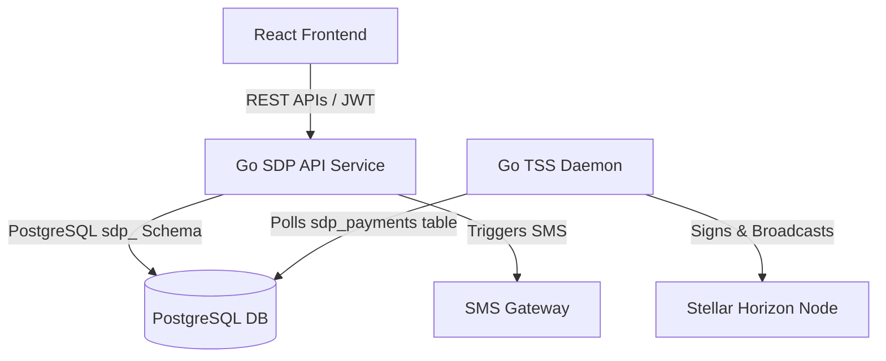

# Go Backend Integration Architecture Guide

This document describes how to connect the simplified React/Tailwind frontend to the Go-based **Stellar Disbursement Platform (SDP)** backend, **Horizon** ledger network node, **Transaction Submission Service (TSS)** daemon, and **KYC Verification** services.

---

## 1. System Architecture Overview

The SDP is designed as a modular Go service architecture interfacing with PostgreSQL and the Stellar network:



1. **Go SDP API Service**: Core REST API written in Go that handles disbursements creation, user management, and configuration.
2. **Transaction Submission Service (TSS)**: A background daemon written in Go that polls the PostgreSQL database for payments in `ready` state, builds/signs Stellar transactions using distribution channel accounts, and submits them to the Horizon endpoint.
3. **Horizon Node**: The gateway to the Stellar Network, used to query balances, distribution account trustlines, and ledger status.
4. **KYC Service (SEP-24/SEP-10)**: Authenticates receivers via phone and OTP verification, checking Date of Birth (DOB) credentials against the database.

---

## 2. API Integration Specifications

All HTTP requests to the Go API must be authenticated using JSON Web Tokens (JWT) in the headers:
```http
Authorization: Bearer <JWT_TOKEN>
Content-Type: application/json
```

---

## 3. Phase 1 Integration: CSV Upload & Validation

When the CSV file is uploaded, the frontend submits it to the Go API to validate schema structure, calculate total outflows, and verify asset code support.

### New Disbursement Creation
* **Endpoint**: `POST /disbursements`
* **Content-Type**: `multipart/form-data`
* **Parameters**:
  * `file`: The `.csv` file.
  * `name`: Display name for the payout batch.
  * `asset_code`: `USDC` or `XLM`.
* **Go Backend Processing**:
  * Go parses the CSV using `encoding/csv`.
  * Verifies unique `paymentID` references.
  * Checks phone numbers against E.164 formats.
  * Returns validation feedback.
* **Success Response (201 Created)**:
  ```json
  {
    "id": "disb-9021",
    "name": "Marsabit Emergency",
    "status": "draft",
    "total_amount": "2620.00",
    "receivers_count": 4,
    "asset_code": "USDC",
    "payments": [
      { "payment_id": "PAY_01", "phone": "16042424000", "amount": "520.00" },
      { "payment_id": "PAY_02", "phone": "16034568000", "amount": "600.00" }
    ]
  }
  ```

---

## 4. Phase 2 Integration: KYC DOB Validation and Approvals

During Phase 2, the frontend displays verification checks (DOB match checks) and submits the disbursement batch for final approval.

### Receiver KYC Status Check
Before approving, the frontend checks if the receiver exists and has passed OTP/DOB KYC validation:
* **Endpoint**: `GET /receivers?search=<paymentID>`
* **Response (200 OK)**:
  ```json
  {
    "id": "rcv-101",
    "phone": "16042424000",
    "verification_dob": "01/12/1987",
    "kyc_status": "Verified"
  }
  ```

### Batch Approval Submission
To transition the disbursement from `draft` to `ready` state, the manager submits the approval:
* **Endpoint**: `POST /disbursements/{id}/approve`
* **Response (200 OK)**:
  ```json
  {
    "id": "disb-9021",
    "status": "ready"
  }
  ```

---

## 5. Phase 3 Integration: Go TSS & Horizon Settlement

Once the disbursement status changes to `ready`, the background Go TSS daemon begins processing the payment rows.

### How the TSS Daemon Works (Go Logic)
1. **Queue Polling**: The TSS polls the `sdp_payments` table for rows in `ready` state.
2. **Batch Assembly**: Groups payments to optimize network fees and transaction operations.
3. **Stellar Envelope Signing**: TSS utilizes stored channel account keys to sign the transaction envelopes.
4. **Horizon Broadcast**: Transaction envelopes are posted to the Horizon endpoint.
5. **Ledger Confirmation**: Horizon submits the transactions to Stellar validators. Upon ledger closure, the payment record in PostgreSQL is marked as `success` with the corresponding `stellar_tx_hash`.

### Tracing Logs on Frontend
The Phase 3 terminal container simulates logging by polling the Go API log stream:
* **Endpoint**: `GET /disbursements/{id}/logs`
* **Event Stream**: Stream output logs from the Go container:
  ```
  [sdp-api] INFO: Commenced validation checks for batch disb-9021.
  [sdp-api] INFO: SMS dry-run invitations dispatched.
  [sdp-api] INFO: Handshake completed for SEP-10 OTP validation.
  [sdp-tss] INFO: Signing transaction batch for 4 payments.
  [Horizon] INFO: Transaction submitted. Ledger 482190 closed. Hash: 4b9e4a3...
  ```

### Polling Settlement Outcome
* **Endpoint**: `GET /disbursements/{id}`
* **Response (200 OK)**:
  ```json
  {
    "id": "disb-9021",
    "status": "completed",
    "tx_hash": "4b9e4a3b8d6fa8c2d9e0f1a2...",
    "completed_at": "2026-07-15T14:16:09Z"
  }
  ```
