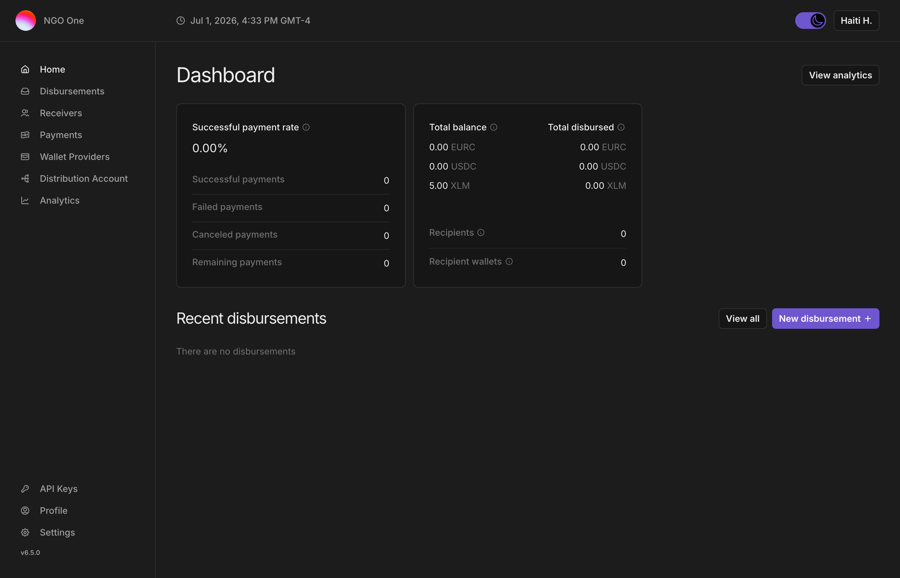

# SDP Multi-Wallet — End-to-End Playtest Guide

*For internal QA and partner playtesting of the multi-distribution-account feature on the demo instance. Every flow below has been verified live on the "NGO One" tenant.*

---

## 1. What you're testing

The platform now supports **multiple distribution (sending) accounts per organization**, with per-account access control. A single org (e.g. an NGO) can run separate accounts — "HQ", "Haiti", "Venezuela" — each with its own on-chain account and separately-encrypted keys, and grant staff access to only the accounts they should touch. The headline things to exercise:

- **Always knowing which account you're on** (the active-account switcher, on every page)
- **Switching accounts** and seeing data re-scope (balances, analytics, receivers, payments, disbursements)
- **Role-based access** — owners see everything; country users see only their account(s)
- **Owner self-service** — add a new account, grant/revoke access, all from the dashboard
- **Creating a disbursement** from a chosen account

## 2. Access

- **URL:** https://dashboard-production-56ea.up.railway.app
- **Organization name (at login):** `ngo-one`

| Login | Password | Role | Sees |
|---|---|---|---|
| cfo@ngoone.playtest | (in the playtest invite) | Owner | All 3 accounts + management |
| treasurer@ngoone.playtest | (in the playtest invite) | Owner | All 3 accounts + management |
| haiti.head@ngoone.playtest | (in the playtest invite) | Financial Controller | Haiti only |
| venezuela.head@ngoone.playtest | (in the playtest invite) | Financial Controller | Venezuela only |
| shared.treasurer@ngoone.playtest | (in the playtest invite) | Financial Controller | Haiti + Venezuela |

> The three accounts hold test **XLM and USDC** (roughly tens of USDC each), so you can create **and start** a USDC disbursement. Payments settle to each recipient once they onboard their receiving wallet (the standard SEP-24 flow); until then they sit as **READY**. Keep a disbursement's total within the account's balance (see Flow F).

---

## 3. Core flows

### Flow A — Orientation & the active-account switcher
1. Sign in as **HQ CFO**.
2. Look at the top of the page: the **Distribution account** switcher shows the active account with a colored dot.
3. Click it. The menu lists **All accounts** (with the summed balance) and each account (HQ / Haiti / Venezuela) with its **live balance**, a **color dot**, and a **checkmark** on the current one.
4. **Expected:** the switcher is visible on **every** page (navigate to Receivers, Payments, Disbursements, Analytics and confirm it stays, showing the same active account).
5. **Watch for:** any page where you *can't* tell which account you're looking at; a balance that looks wrong; the switcher not appearing.

### Flow B — Switching accounts re-scopes everything
1. As **HQ CFO**, switch the account from **All accounts → HQ → Haiti**.
2. **Expected:** the dashboard's **Total balance** and stats update to the chosen account; "All accounts" shows the aggregate (sum of all three).
3. Navigate to **Receivers**, **Payments**, **Disbursements** — each list should reflect the selected account.
4. **Watch for:** stale numbers after switching; a list that doesn't change; the selection not persisting when you change pages.

### Flow C — Role-based access (the important one)
1. Sign out, sign in as **Haiti Country Head**.
2. **Expected:** they see **only Haiti**. No HQ, no Venezuela. No "Add account" or "Manage access" controls. (With only one account, the switcher may not show — that's intended; there's no ambiguity.)
3. Sign in as **Shared Treasurer** → should see **Haiti + Venezuela** (and can switch between just those two), but not HQ.
4. **Watch for:** any account or data showing that a user shouldn't be able to see. This is the single most important thing to report.

### Flow D — Owner adds a new account
1. As an **Owner**, on **Home**, find the **Distribution accounts** card → click **Add account**.
2. Name it (e.g. `Kenya`), submit.
3. **Expected:** a new funded account appears within a few seconds, and shows up in the switcher.
4. **Watch for:** errors on create; the account not appearing; a non-owner being able to see this button (they shouldn't).

### Flow E — Owner manages access
1. As an **Owner**, on the **Distribution accounts** card, click **Manage access** on an account.
2. Grant a user access (pick a user + role), then revoke it.
3. **Expected:** the change takes effect immediately; log in as that user to confirm they gained/lost the account.
4. **Watch for:** granting the wrong scope; a revoked user still seeing the account.

### Flow F — Create a disbursement
1. As an **Owner** (or a Financial Controller), **first select the account** you want to disburse from in the switcher (e.g. HQ). *Not* "All accounts."
2. Click **New disbursement**.
3. Choose: **Wallet = Demo Wallet**, **Asset = USDC**, **Contact type = Phone Number**, **Verification = Date of Birth**.
4. Upload the sample file: [ngo-one-disbursement-sample.csv](ngo-one-disbursement-sample.csv).
5. Review and save.
6. **Expected:** the disbursement is created against the account you selected, with 5 recipients parsed. Keep the CSV's total amount within the selected account's balance, or **"Confirm disbursement" stays disabled** (the platform blocks over-drawing an account — this is correct behavior). If you have "All accounts" selected, creation is **correctly blocked** with a message that a specific account is required — that's expected, not a bug.
7. **Watch for:** a disbursement created against the wrong account; CSV upload errors; the create failing even with an account selected.

### Flow G — Analytics
1. Open **Analytics** (or "View analytics" from the dashboard).
2. **Expected:** the same account scoping applies; **Average amount** appears here (it was moved off the main dashboard to keep that focused on live balance + total disbursed).

---

## 4. What to report
For anything off, note: **which login**, **which account was selected**, **which page**, **what you expected vs. saw**, and a screenshot if possible. Priority order:
1. **Any cross-account data leak** (seeing an account/data you shouldn't) — highest priority.
2. Actions applied to the wrong account.
3. Confusion about which account you're on.
4. Errors / broken flows.
5. Polish / wording / layout.

## 5. Known limitations this round
- Accounts hold test XLM + USDC, so disbursements can be created and started. Actual settlement to a recipient needs that recipient to onboard their wallet (SEP-24); demo recipients are generally not onboarded, so payments sit at READY (no funds move) unless you complete registration.
- Single-account users don't see the switcher (intended — no ambiguity).
- The demo instance is on testnet; nothing here touches real money.

## 6. Feedback
Send findings to the Hypotenuse team (or drop in the shared Slack channel). Kelly & Andre's day-to-day usability feedback is especially wanted — flag anything that would slow down or confuse a real operator.
