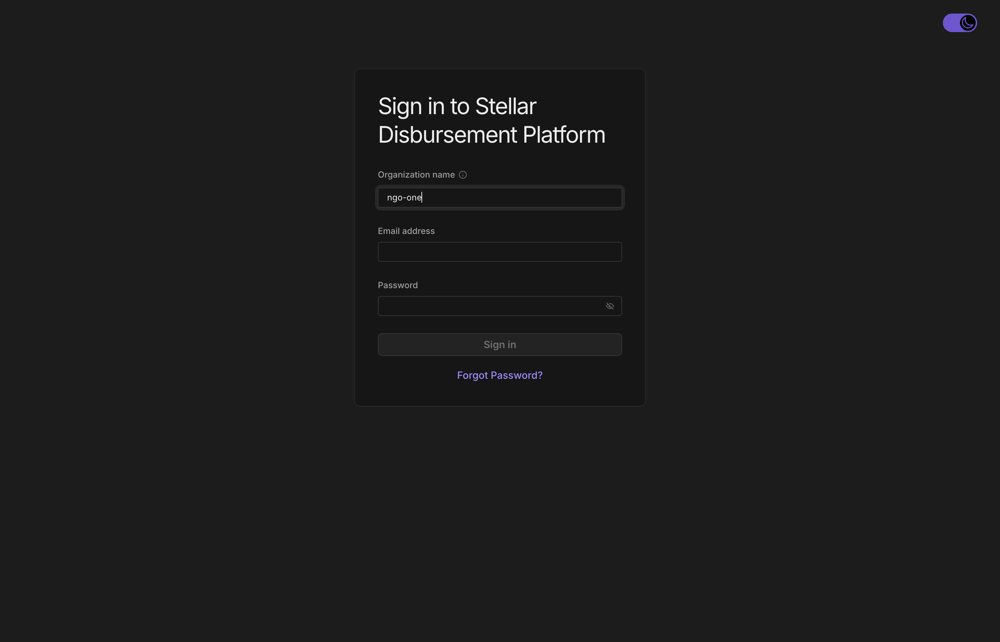
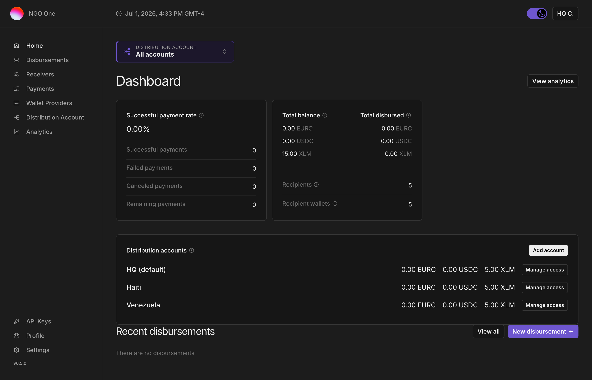
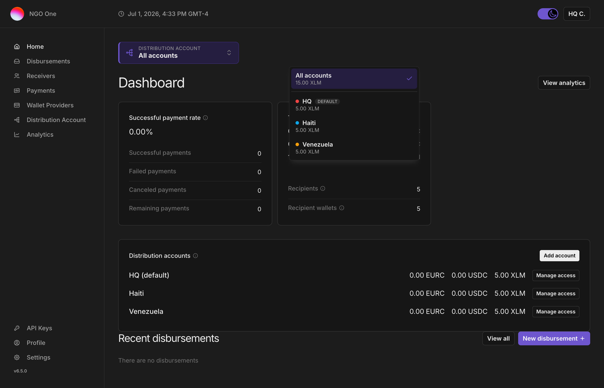
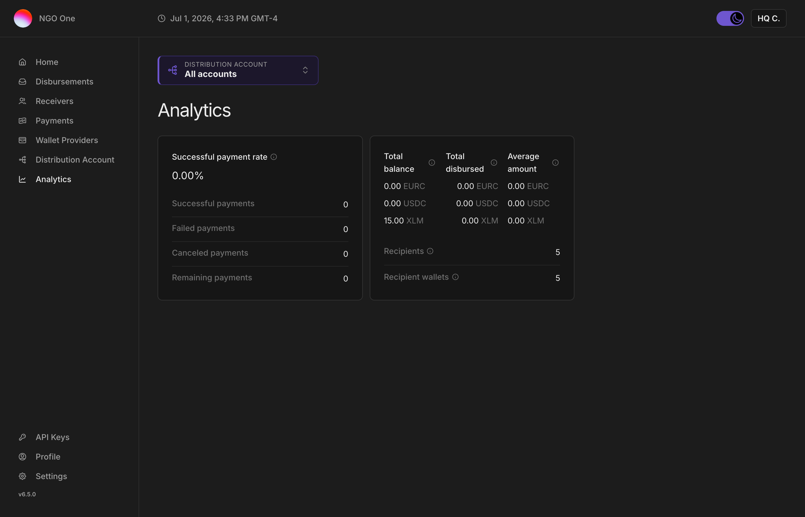
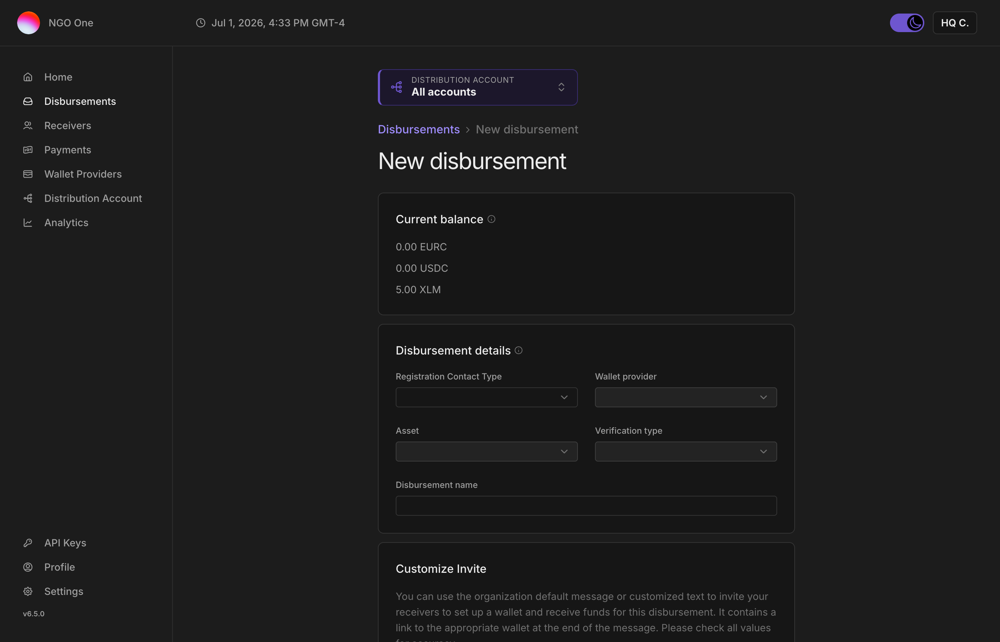
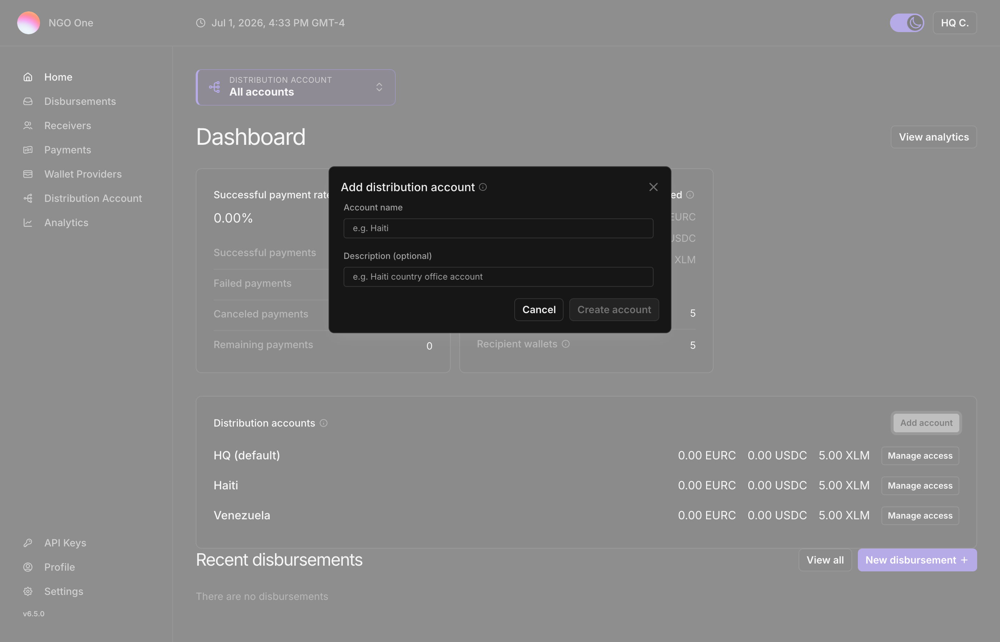
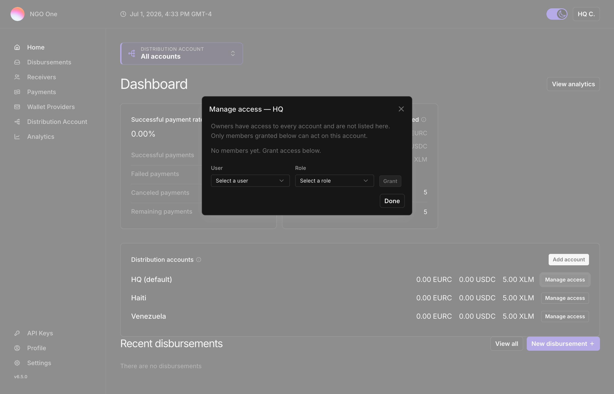

# Stellar Disbursement Platform — User Guide

*A step-by-step guide to running disbursements with multiple distribution accounts. Written for operators and partner organizations. Screenshots reference the "NGO One" demo (org `ngo-one`); your organization and account names will differ.*

> **Screenshots:** placeholders below (`screenshots/…`) mark where each image goes. Each step also has a **"What you'll see"** description so the guide is usable on its own; a fully-illustrated PDF can be produced from this outline.

---

## Key idea: distribution accounts

Your organization can have several **distribution accounts** — the accounts money is sent *from* (e.g. "HQ", "Haiti", "Venezuela"). Each is a separate on-chain account with its own balance. You always act on **one selected account at a time** (or an "All accounts" overview if you're an admin). The **account switcher** at the top of every page shows which one you're on.

Don't confuse a *distribution account* (your sending account) with a *wallet provider* (the app your **recipients** use to receive funds, like Vibrant or Decaf).

---

## 1. Signing in

1. Go to the platform URL.
2. Enter your **Organization name**, **Email**, and **Password**.
3. Click **Sign in**.



**What you'll see:** a sign-in card with Organization name, Email, and Password fields.

---

## 2. The dashboard at a glance

After signing in you land on the **Dashboard**.



**What you'll see:**
- The **account switcher** at the very top ("Distribution account: …").
- **Successful payment rate** and payment counts.
- **Total balance** (live, on-chain) and **Total disbursed** (lifetime).
- A **Distribution accounts** card listing each account and its balance.
- **Recent disbursements** below.

All the numbers reflect the **currently selected account**.

---

## 3. Knowing and switching your active account

This is the most important control. The **account switcher** sits at the top of every page.

1. Read the switcher to see your **current account** (shown with a colored dot and its name).
2. Click it to open the menu.
3. Pick an account — or **All accounts** (admins only) for a combined view.



**What you'll see:** a menu listing **All accounts** (with the combined balance) and each account with its **color**, **live balance**, and a **checkmark** on the one you're currently using. Each account keeps the same color everywhere, so you learn to recognize it at a glance.

**When you switch, the whole app re-scopes** to that account — balances, analytics, receivers, payments, and disbursements all update. Your selection follows you as you move between pages.

> If you only have access to one account, the switcher doesn't appear — there's nothing to choose between.

---

## 4. Reading balances and analytics

- **Total balance** (on the dashboard) is the live, spendable balance of the selected account — the "can I disburse right now?" number.
- **Total disbursed** is the lifetime amount that account has sent.
- For deeper metrics, open **Analytics** (or **View analytics** on the dashboard). It shows the same figures plus the **Average amount** per payment, scoped to the selected account.



---

## 5. Sending a disbursement

A disbursement pays a list of recipients from **one account**.

1. **Select the account** you want to pay from in the switcher (e.g. "Haiti"). *Don't* leave it on "All accounts" — you must choose a specific account to disburse from.
2. Click **New disbursement**.
3. Fill in the details:
   - **Wallet** (the recipient app), e.g. **Demo Wallet**
   - **Asset**, e.g. **USDC**
   - **Contact type**, e.g. **Phone Number**
   - **Verification**, e.g. **Date of Birth**
4. **Upload your recipient file** (CSV). See the format in the Appendix; a working sample is [ngo-one-disbursement-sample.csv](ngo-one-disbursement-sample.csv).
5. **Review** the parsed recipients and totals.
6. **Confirm** to create the disbursement.



**What you'll see:** a multi-step form (details → upload → review). After confirming, the disbursement is created **against the account you selected** and lists its recipients.

> The disbursement's approver must belong to that account. If your organization requires **four-eyes approval**, the person who creates a disbursement can't be the one who approves it — a second authorized person approves it.

---

## 6. (Admins) Adding a new account

Owners can create a new distribution account at any time.

1. On the **Dashboard**, find the **Distribution accounts** card.
2. Click **Add account**.
3. Enter a **name** (e.g. "Kenya") and an optional description, then submit.



**What you'll see:** a short form; after submitting, a brand-new account is created, funded, and appears in the switcher within a few seconds. It gets its own on-chain account with separately-secured keys.

---

## 7. (Admins) Managing who can access an account

Owners control, per account, who can see and act on it.

1. On the **Distribution accounts** card, click **Manage access** on an account.
2. To **grant**: pick a user and a role, then add them.
3. To **revoke**: remove a user from the list.



**What you'll see:** a panel listing who currently has access to that account, with controls to add or remove people. Changes take effect immediately.

---

## Appendix A — Roles

| Role | What they can do |
|---|---|
| **Owner** | Everything: see all accounts, add accounts, manage access and users, create and approve disbursements. |
| **Financial Controller** | Full control of the accounts they're granted — create and approve disbursements — but can't manage org users. |
| **Initiator** | Create draft disbursements, but can't approve/submit them. |
| **Approver** | Approve/submit disbursements, but can't create them. |
| **Business** | Read-only access to data. |
| **Developer** | Technical/config access (assets, API keys), no disbursements. |

Access is **per account**: a Financial Controller granted "Haiti" sees and acts on Haiti only. Owners are organization-wide.

## Appendix B — Recipient CSV format

Columns: `phone,id,amount,verification`

- **phone** — recipient's phone in international format (e.g. `+14155238886`). Must be a valid number.
- **id** — your own reference for the recipient (any unique text).
- **amount** — how much to send, in the disbursement's asset.
- **verification** — must match the disbursement's verification type. For **Date of Birth**, use `YYYY-MM-DD`.

Example:
```
phone,id,amount,verification
+14155238886,NGO-001,50,1990-04-12
+12024561414,NGO-002,75,1985-11-30
```

If you use **Email** as the contact type instead of phone, use an `email` column instead of `phone`.

## Appendix C — Troubleshooting

- **"New disbursement" is blocked / asks for an account** — you have "All accounts" selected. Pick a specific account first.
- **CSV rejected** — check the phone numbers are valid international format, the date of birth is `YYYY-MM-DD`, and every row has an `id` and `amount`.
- **I don't see the account switcher** — you only have access to one account, so there's nothing to switch. If you expected more, ask your organization's owner to grant access.
- **I can't see an account a colleague mentioned** — access is per account; an owner needs to grant you access via **Manage access**.
